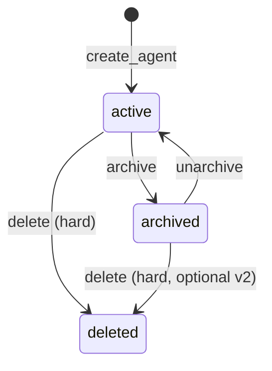

# План: архивирование агентов

## Цель

Дать безопасную альтернативу удалению: агент перестаёт участвовать в runtime (новые запуски, ingress, publish), но **история skill runs и публикации сохраняются**. Cockpit и список агентов по умолчанию показывают только активных.

Удаление (`DELETE /api/agents/{slug}`) остаётся отдельной операцией для редких случаев (тестовые агенты, полная очистка).

---

## Модель состояний



| Состояние | `archived_at` | Конструктор | Publish | Новые runs | Ingress | Cockpit (default) |
|-----------|---------------|-------------|---------|------------|---------|-------------------|
| **active** | `NULL` | read/write | да | да | да | виден |
| **archived** | timestamp | read-only* | нет | нет | нет | скрыт |
| **deleted** | — | — | — | — | — | только orphan runs |

\* v1: GET draft/publications разрешён; PUT draft / validate / publish — 409.

**Ephemeral** (`eva-test-*`, …) — по-прежнему **hard delete** через `prune_ephemeral_agents()`, не archive.

---

## 1. Схема БД

**Файл:** `backend/infrastructure/models/tables.py`

```python
archived_at: Mapped[datetime | None] = mapped_column(DateTime(timezone=True), nullable=True, default=None)
```

- Индекс: `(archived_at)` или partial index `WHERE archived_at IS NULL` — по необходимости после замеров.
- Проект по умолчанию использует `Base.metadata.create_all` (`deps.py`). Для существующих БД:
  - Alembic revision `add_agents_archived_at`, **или**
  - одноразовый SQL: `ALTER TABLE agents ADD COLUMN archived_at TIMESTAMPTZ NULL;`

Slug остаётся занятым у archived-агента (нельзя создать нового с тем же slug без unarchive или delete).

---

## 2. Backend — AgentService

**Файл:** `backend/definition/services/agent_service.py`

### Новые методы

| Метод | Поведение |
|-------|-----------|
| `is_archived(agent: AgentRow) -> bool` | `archived_at is not None` |
| `assert_active(slug) -> AgentRow` | 409 `AgentArchived` если archived |
| `archive_agent(slug) -> dict` | set `archived_at=now()`, опционально cancel active runs |
| `unarchive_agent(slug) -> dict` | `archived_at=None` |
| `list_agents(*, include_archived=False)` | фильтр `archived_at IS NULL` по умолчанию |

### Guards в существующих методах

| Метод | При archived |
|-------|----------------|
| `upsert_draft` | 409 |
| `validate_draft` | 409 (или разрешить read-only validate — не нужно в v1) |
| `publish` | 409 |
| `get_agent_by_slug` | возвращать агента + поле `archivedAt` (read-only просмотр) |
| `delete_agent` | без изменений (hard delete) |
| `create_agent` | slug conflict если запись есть (в т.ч. archived) |

### Archive side-effect (рекомендация v1)

При `archive_agent`:
1. Установить `archived_at`.
2. **Отменить активные runs** (`running`, `waiting`) для этого `agent_slug` через существующий cancel в runtime store / worker — чтобы ingress не «оживлял» архивного агента.

Отдельный флаг `cancelActiveRuns` в API — опционально v1.1; в v1 всегда отменять с confirm на UI.

---

## 3. Backend — API

**Файл:** `backend/app/api/agents.py`

| Endpoint | Описание |
|----------|----------|
| `GET /api/agents?includeArchived=true` | список с фильтром |
| `POST /api/agents/{slug}/archive` | 200 + summary; 403 demo; 404 |
| `POST /api/agents/{slug}/unarchive` | 200 |
| `GET /api/agents/{slug}` | добавить `archivedAt` в ответ |

**Схемы:** `backend/definition/schemas/agent_api.py`

- `AgentSummaryApi`, `AgentApi`: поле `archived_at: str | None` (`archivedAt`).
- `AgentArchiveResponseApi`: `{ slug, archivedAt }`.

Код ошибки: HTTP **409** с `detail: "Agent is archived"` для мутаций; **403** для demo slugs.

---

## 4. Runtime guards

Точка входа — helper `assert_agent_active(session, agent_slug)` в `agent_service` или `runtime/guards.py`.

| Место | Действие |
|-------|----------|
| `build_runtime_service()` | проверка до resolve publication → KeyError/409 |
| `POST /api/runtime/runs` (create) | 409 |
| `POST /api/runtime/runs/{id}/start` | 409 для **нового** старта; resume существующего waiting run — **разрешить** (завершить хвост) |
| `POST /api/runtime/events` | если run уже создан — OK; новый run через ingress — блок на уровне ingress |
| `GET /api/runtime/*` (list, summary, detail) | без блокировки — история доступна |

**Файлы:** `runtime_factory.py`, `app/api/runtime.py`, `app/api/channels/web.py`, `app/api/channels/telegram.py`, `event_ingress.py`.

---

## 5. Runtime Cockpit — фильтрация

**Файл:** `backend/infrastructure/stores/postgres_skill_run_store.py`

`summarize_runtime()` сейчас группирует по `skill_runs.agent_slug` и подмешивает slugs из publications — отсюда «призраки» `eva-test-*`.

### Изменения v1 (в рамках archiving)

1. Загрузить множество **active** slugs: `SELECT slug FROM agents WHERE archived_at IS NULL`.
2. В итоговый список cockpit включать только slugs из этого множества **или** явно помечать archived (лучше — исключить из default).
3. Orphan slugs (нет строки в `agents`) — **не показывать** в global summary (отдельная задача cleanup ephemeral runs).

`GET /api/runtime/runs?agentSlug=` — без изменений (история archived-агента доступна по прямой ссылке).

`GET /api/runtime/agents/{slug}/summary` — 404 если slug не существует; для archived — отдавать summary + флаг `archived: true` (расширить `AgentRunCounts`).

---

## 6. Frontend

### Типы и API

- `frontend/src/features/agents/types/agent.ts` — `archivedAt?: string | null`
- `agentsApi.ts` — `archiveAgent`, `unarchiveAgent`, `fetchAgentsList({ includeArchived })`

### Список агентов

**`AgentsListView.vue`**

- Табы: **Активные** | **Архив**
- `AgentCard`: «Архивировать» вместо/рядом с «Удалить»; в архиве — «Восстановить»
- Confirm: «Активные запуски будут отменены»

### Workspace

**`router/guards.ts`**

- Archived agent: редирект с workspace routes (`/:slug/...`) на read-only view или `/agents?tab=archive` с toast «Агент в архиве».
- Исключение: `/:slug/runtime/*` — разрешить просмотр истории (read-only, без Simulate).

### Runtime Cockpit

- Global / agent dashboard: только active agents (данные уже отфильтрованы API).
- Для archived: баннер «Агент архивирован» + ссылка «Восстановить» в `AgentRuntimeView`.

### Publish / Save

- Скрыть или disable Publish и автосохранение draft для archived (проверка `archivedAt` на клиенте + 409 от API).

---

## 7. Тесты

**Новый файл:** `backend/tests/test_agent_archive.py`

| # | Сценарий |
|---|----------|
| 1 | archive → list без slug; includeArchived=true → есть |
| 2 | archive → publish / upsert → 409 |
| 3 | archive → create run → 409 |
| 4 | archive любого агента (включая бывшие demo-slug) → 200 |
| 5 | unarchive → publish снова OK |
| 6 | archive отменяет running/waiting runs |
| 7 | summarize_runtime не включает archived slug |
| 8 | telegram/web ingress на archived → 409 |

Обновить `test_runtime_cockpit_api.py` при изменении summarize.

---

## 8. Документация

- `docs/RUNTIME_IMPLEMENTATION_STATUS.md` — секция archived agents
- `architecture/agent_architecture_v1.md` — краткое описание lifecycle (опционально, отдельным коммитом)
- `.cursor/skills/eva-backend/SKILL.md` — упоминание archive API

---

## 9. Порядок реализации (фазы)

### Фаза A — Backend core (~0.5 дня)

1. Column `archived_at` + migration/SQL note
2. `archive_agent` / `unarchive_agent` / `list_agents` filter
3. API endpoints + schemas
4. Guards: publish, upsert, create run
5. Unit/integration tests

### Фаза B — Runtime & Cockpit (~0.5 дня)

1. `summarize_runtime` filter active agents
2. Channel ingress guards
3. Cancel runs on archive
4. Cockpit tests

### Фаза C — Frontend (~0.5 дня)

1. API + types
2. Agents list tabs + archive/unarchive UX
3. Route guard + runtime banners
4. Disable publish/simulate for archived

---

## 10. Вне scope v1

- Hard delete с cascade `skill_runs`
- Авто-архив по TTL / retention policy
- Archive в Runtime Cockpit как primary action (только ссылка в agent dashboard)
- Переименование slug при unarchive
- RBAC / audit log archive events
- Показ orphan `eva-test-*` в отдельной dev-секции (отдельная задача: purge endpoint)

---

## 11. Открытые решения (зафиксировать перед кодом)

| Вопрос | Рекомендация |
|--------|--------------|
| Resume waiting run после archive? | Да — дать завершить, новые — нет |
| Delete archived agent в UI? | Да, с усиленным confirm; runs останутся orphan (как сейчас) |
| Просмотр draft archived в конструкторе? | Read-only redirect или отдельная «карточка в архиве» |
| `GET /api/agents/{slug}` для archived | 200 + `archivedAt` (не 404) |
